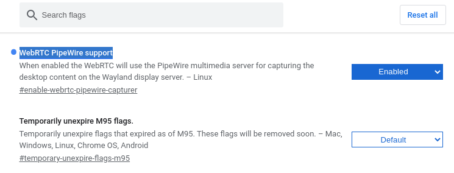

# inicializandoFedora

Um shell script que já configura tudo que preciso no fedora.
Ele é bem pessoal, então sugiro que antes de rodar dê um molhada no que ele instalando.

## Como Executar:

```shell
# Executar sem superusuario. O script esta encarregado de elevar-se (Por isso fica atento, ele pedirá senha)
$ ./main.sh

# Após a execução do script executar o comando abaixo, selecionar português(Brasil) e clicar em 'ok'.
$ system-config-language
```

### Habilitando WebRTC PipeWire support no Google Chrome

Abra o navegador e na URL insira "chrome://flags/#enable-webrtc-pipewire-capturer" e mude a flag para enable 

### Instalando as extensões do gnome

- [AppIndicator and KStatusNotifierItem Support](https://extensions.gnome.org/extension/615/appindicator-support/)
- [Containers](https://extensions.gnome.org/extension/1500/containers/)
- [Bluetooth Quick Connect](https://extensions.gnome.org/extension/1401/bluetooth-quick-connect/)
- [Dash to Dock](https://extensions.gnome.org/extension/307/dash-to-dock/)
- [User Theme](https://extensions.gnome.org/extension/19/user-themes/)
- [Desktop Icons NG](https://extensions.gnome.org/extension/2087/desktop-icons-ng-ding/)

### Configurando tema do bash

Os temas aplicaveis no bash são os temas presentes na [Wiki](https://github.com/Bash-it/bash-it/wiki/Themes), é uma lista extensa de temas possiveis.
Basta mudar o valor da variável yourTheme para o nome do tema que deseja, e o script se encarregará do resto.

### Configurando vscode

- VS Code sendo configurado automaticamente com:
  - Tema:
    - Ayu Mirage
  - Fonte:
    - Fira Code Retina
  - Extensões:
    - EsLint (dbaeumer.vscode-eslint)
    - Prettier (esbenp.prettier-vscode)
    - Python (ms-python.python)
    - Color Highlight (naumovs.color-highlight)

> Configuração no settings.json

```json
{
  "workbench.iconTheme": "vscode-icons",
  "workbench.colorTheme": "Ayu Mirage",
  "editor.fontFamily": "Fira Code Retina",
  "editor.formatOnType": true,
  "editor.tabSize": 2,
  "editor.insertSpaces": false,
  "editor.formatOnType": true,
  "explorer.compactFolders": false,
  "editor.fontLigatures": true,
  "explorer.confirmDelete": false,
  "editor.formatOnSave": true,
  "prettier.eslintIntegration": true,
  "prettier.singleQuote": true,
  "[javascript]": { "editor.defaultFormatter": "esbenp.prettier-vscode" }
}
```

### Configurando Subllime Text

A Configuração do Sublime Text é manual.

> Instale primeiramente o Package Control e o tema Ayu pelo Package Control

```shell
$ echo '{
	"color_scheme": "Packages/ayu/ayu-mirage.sublime-color-scheme",
	"ignored_packages":
	[
		"Vintage"
	],
	"theme": "ayu-mirage.sublime-theme",
	"font_face": "Fira Code Retina",
	"terminal":"gnome-terminal",
	"env": {"LD_PRELOAD": null}
}' > /home/$USER/.config/sublime-text-3/Packages/User/Preferences.sublime-settings
```

### Configurando o Postgres

Particulamente eu gosto de seguir a [Documentação de configuração do Fedora](https://fedoraproject.org/wiki/PostgreSQL#Configuration, 'https://fedoraproject.org/wiki/PostgreSQL#Configuration') para configurar o postgresql.

Contudo como material complementar também existe a [Documentação do Postgres](https://www.postgresql.org/download/linux/redhat/, 'https://www.postgresql.org/').

### Configurando Android Studio

É preciso configurar as licensas.

> Após a execução do script -> abra o Android Studio -> configure a IDE -> Execute o comando abaixo

```shell
$ ~/Android/Sdk/cmdline-tools/latest/bin/./sdkmanager --licenses
```
